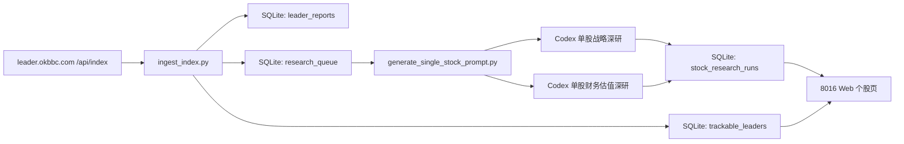

# 架构设计

## 目标

为每日 `A 可跟踪龙头` 提供独立个股页面，展示：

- 合理估值区间及历史叠加
- 行业地位
- 竞争格局
- 上下游公司
- 年增长率
- 五倍/十倍潜力
- 是否具备重仓研究资格
- 单股历史研究记录

## 数据流



## 分层

- `myinveststock/leader_index.py`：读取 `/api/index`，只解析 `key_results.primary_output.items`。
- `myinveststock/db.py`：SQLite schema 和读写函数。
- `myinveststock/web.py`：只读 Web 页面和 JSON API。
- `scripts/ingest_index.py`：每日发现队列。
- `scripts/generate_single_stock_prompt.py`：一次只生成一只股票、一个阶段的深研提示词。
- `scripts/run_web.py`：启动 8016 本地 Web。

## Web 路由

- `/`：今日 A 可跟踪龙头列表。
- `/api/index`：主要结果接口，面向其他系统集成。
- `/api/latest`：研究成果接口，面向研究结果消费。
- `/stocks/{code}`：单股深研页面。
- `/api/stocks`：最新股票列表 JSON。
- `/api/stocks/{code}`：单股页面数据 JSON。
- `/api/queue`：当前研究队列 JSON。

## 页面约束

所有页面底部统一加载：

```html
<script src="https://invest.okbbc.com/footer.js" defer></script>
```

Web 侧不写入数据库，所有入库都由脚本或自动化任务完成。

## 两阶段研究

- `strategic`：战略深研，关注行业空间、竞争格局、上下游、长期壁垒和五倍/十倍潜力。默认只做一次，除非长期逻辑发生重大变化。
- `financial`：财务估值深研，关注财务质量、增长率、估值区间、当前价格位置和重仓研究资格。可随财报、价格和主线变化多次刷新。
