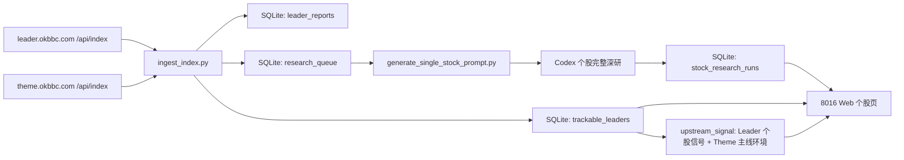

# 架构设计

## 目标

为每日 `A 可跟踪龙头` 提供独立个股页面，展示：

- 合理估值区间及历史叠加
- 行业地位
- 竞争格局
- 上下游公司
- 年增长率
- 数倍潜力
- 是否具备重仓研究资格
- 个股历史研究记录

## 数据流



## 分层

- `myinveststock/leader_index.py`：读取 `/api/index`，只解析 `key_results.primary_output.items`。
- `myinveststock/theme_index.py`：读取 Theme `/api/index`，从 `mainline_ranking`、`legacy_theme_ranking` 和 `market` 摘要主线环境。
- `myinveststock/db.py`：SQLite schema 和读写函数。
- `myinveststock/web.py`：只读 Web 页面和 JSON API。
- `scripts/ingest_index.py`：每日发现队列。
- `scripts/generate_single_stock_prompt.py`：一次只生成一只股票的一条完整深研提示词。
- `scripts/monitor_research_triggers.py`：监测是否需要重新做完整个股深研。
- `scripts/run_web.py`：启动 8016 本地 Web。

## 上游主线信号边界

MyInvestLeader 负责个股候选和龙头证据，MyInvestTheme 负责主线强度、生命周期、周期阶段、ETF/板块趋势、拥挤和风险偏好。MyInvestStock 不重新研究主线强弱，只把 Leader 的个股入口信号与 Theme 的主线环境快照整理为 `upstream_signal`。

边界：

- 股票池只来自 `leader.okbbc.com/api/index -> key_results.primary_output.items`。
- 主线环境只来自 `theme.okbbc.com/api/index -> mainline_ranking / legacy_theme_ranking / market`。
- 手工 `/research?stock={code}` 入队的股票不要求出现在 Leader 股票池；如果 Theme 无法匹配主题，记录为数据缺口，不强行绑定。

MyInvestStock 的确定性估值只回答“财务安全边际是否足够”。页面和 `/api/latest` 使用 `decision_matrix` 组合两类信号：

- 上游主线强 + 财务安全高：核心候选研究。
- 上游主线强 + 财务安全低：主线弹性跟踪，不按安全边际重仓。
- 上游主线弱 + 财务安全高：价值观察，等待催化。
- 上游主线弱 + 财务安全低：风险释放优先。

## Web 路由

- `/`：今日 A 可跟踪龙头列表。
- `/api/index`：主要结果接口，面向其他系统集成。
- `/api/latest`：研究成果接口，面向研究结果消费。
- `/stocks/{code}`：个股深研页面。
- `/api/stocks`：最新股票列表 JSON。
- `/api/stocks/{code}`：个股页面数据 JSON。
- `/api/queue`：当前研究队列 JSON。

## 页面约束

所有页面底部统一加载：

```html
<script src="https://invest.okbbc.com/footer.js" defer></script>
```

Web 侧不写入数据库，所有入库都由脚本或自动化任务完成。

## 单一完整深研

新任务只保留 `stock_research`。每次触发都输出完整个股深研，覆盖行业空间、竞争格局、上下游、长期壁垒、数倍潜力、财务质量、增长率、估值区间、当前价格位置和重仓研究资格。

`trigger_reason` 记录本次为什么重研，例如：

- 新进入可跟踪龙头
- 手工请求研究
- 财报更新
- 重大事件
- 估值中枢变化
- 定期复核

数据库初始化会清理旧任务类型和旧估值记录，避免页面继续展示不兼容历史。
